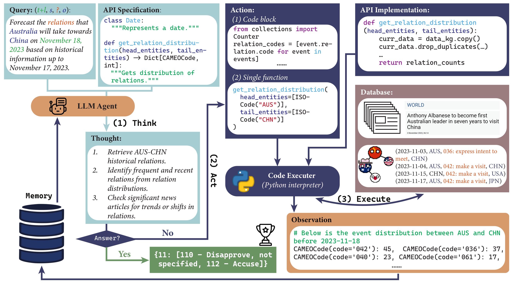

# Vanguard AI: Advanced Temporal Forecasting and Event Intelligence

<p align="center">
  
</p>

[](https://opensource.org/licenses/MIT)
[](https://www.python.org/downloads/)
[](#)
[](https://www.gdeltproject.org/)

## 🌐 Overview

**Vanguard AI** is a production-grade framework designed for high-fidelity temporal forecasting of global events. By leveraging Large Language Model (LLM) agents equipped with domain-specific tool-use capabilities, Vanguard autonomously synthesizes historical data, relational dynamics, and real-time news to predict future geopolitical and international relations.

Inspired by FAANG-level agentic architectures, Vanguard separates the **Forecasting Engine**, **Data Pipeline**, and **Evaluation Core** into a modular, scalable repository structure optimized for research and production deployment.

---

## 🚀 Key Features

- **Multi-Source Intelligence**: Seamlessly integrates GDELT-structured event data with unstructured news archives.
- **Agentic Reasoning (ReAct)**: Implements iterative Think-Act-Observe loops allowing agents to query databases, write code, and refine forecasts dynamically.
- **Relational Forecasting**: Specialized in predicting complex interactions between global actors across multiple temporal horizons.
- **Extensible API Interface**: Modular API implementation for KG (Knowledge Graph) and News retrieval.
- **State-of-the-Art Evaluation**: Comprehensive metrics for assessing F1 scores, temporal accuracy, and reasoning consistency.

---

## 📂 Project Structure

```bash
vanguard-ai/
├── src/
│   ├── core/           # API implementations and database interfaces
│   ├── engine/         # LLM Agent logic and proprietary prompt engineering
│   ├── pipeline/       # End-to-end data ingestion and cleaning workflows
│   ├── evaluator/      # Benchmarking and performance analysis suite
│   └── utils/          # Shared utilities and text processing models
├── docs/
│   └── assets/         # Technical diagrams and visualizations
├── configs/            # System-wide configurations and API definitions
├── examples/           # Demonstration notebooks and sample outputs
└── tests/              # (Upcoming) Unit and integration testing
```

---

## 🛠️ Getting Started

### Prerequisites

- Python 3.9+
- CUDA-enabled GPU (for local LLM execution)

### Installation

```bash
# Clone the repository
git clone https://github.com/your-repo/vanguard-ai.git
cd vanguard-ai

# Initialize environment
conda create -n vanguard python=3.9 -y
conda activate vanguard

# Install dependencies
pip install -r requirements.txt
pip install flash-attn --no-build-isolation
```

### Environment Configuration

Export your credentials:
```bash
export OPENAI_API_KEY="sk-..."
huggingface-cli login
```

---

## ⚡ Quick Start: Forecasting

To execute a forecasting task using the Vanguard Engine:

```python
# Navigate to the engine directory
cd src/engine

# Run the ReAct agent with GPT-4o
python react_agents.py --model_name gpt-4o-2024-05-13 --action block --api full
```

---

## 🔬 Scientific Foundation

Vanguard AI is built upon the research presented in:
**"MIRAI: Evaluating LLM Agents for Event Forecasting" (arXiv:2407.01231)**.

### Citation
```bibtex
@misc{ye2024vanguardevaluatingllmagents,
      title={Vanguard AI: Evaluating LLM Agents for Event Forecasting}, 
      author={Chenchen Ye and Ziniu Hu and Yihe Deng and Zijie Huang and Mingyu Derek Ma and Yanqiao Zhu and Wei Wang},
      year={2024},
      eprint={2407.01231},
      archivePrefix={arXiv},
      primaryClass={cs.CL}
}
```

---

## 📜 Governance and Terms

Vanguard AI is released for research purposes. Data usage complies with GDELT Project terms. All redistributions must include proper attribution.

---
<p align="center">
  Developed by <b>Vanguard Research</b> | 2024
</p>
